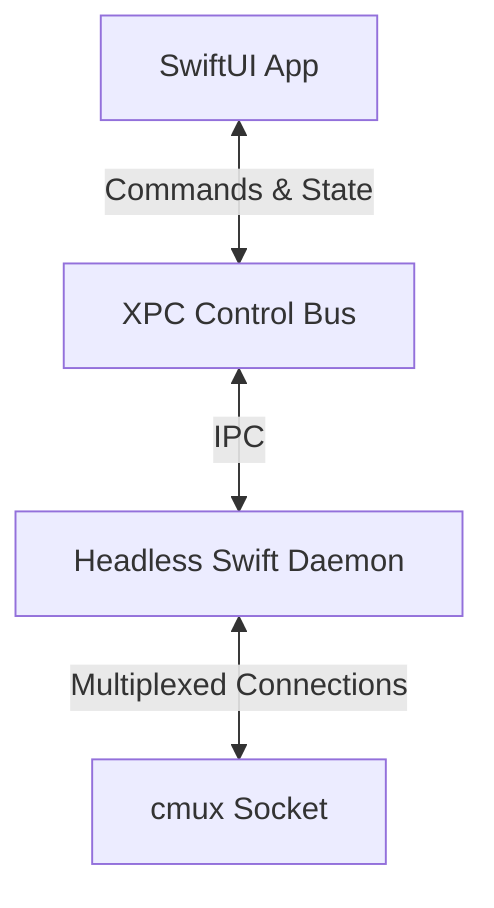
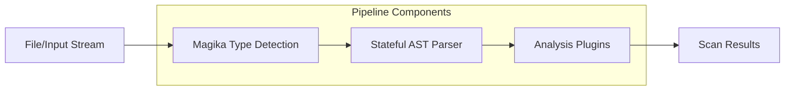

# Seabubble V2 Architecture

## Overview
Seabubble V2 represents a foundational shift towards a **100% Native Swift** architecture. By moving away from hybrid or bridge-based IPC, V2 leverages **XPC (macOS Inter-Process Communication)** to provide a secure, high-performance, and robust boundary between the user interface and the core engine.

This transition ensures:
- **Maximum Performance:** Direct memory access patterns and native Swift concurrency.
- **Enhanced Security:** Privilege separation using XPC to isolate the SwiftUI frontend from the Headless Swift Daemon.
- **Maintainability:** A unified language ecosystem (Swift) reducing bridging overhead and context switching.

## Component Architecture

### 1. High-Level Flow
The primary components communicate seamlessly over an XPC Control Bus. The UI layer remains lightweight, delegating heavy processing to a headless daemon, which in turn can expose multiplexed connections via a `cmux` socket for external or internal routing.

### 2. Scanner Pipeline
The core of Seabubble's file analysis is the Scanner Pipeline. It is designed to be extensible and state-aware, utilizing a plugin architecture, stateful Abstract Syntax Trees (AST), and Magika for rapid file type identification.

## Conclusion
The V2 Native Swift architecture provides the solid foundation necessary for Seabubble to operate efficiently as a macOS-native security and scanning tool, ensuring scalability, tight system integration, and robust performance.
